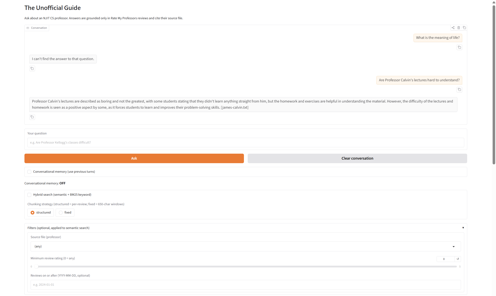
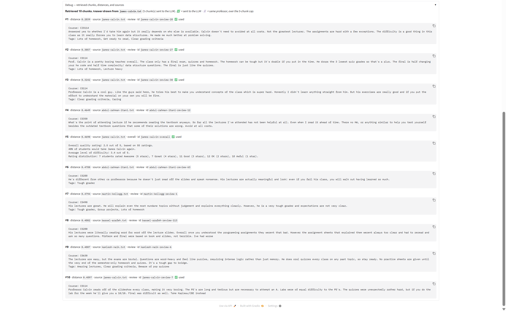

# The Unofficial Guide — Project 1

_Krish A. Patel_

_CodePath AI201: Applications of AI Engineering (Summer 2026)_

---

## Domain

<!-- What topic or category of knowledge does your system cover?
     Why is this knowledge valuable, and why is it hard to find through official channels?
     Example: "Student reviews of CS professors at [university] — useful because official
     course descriptions don't reflect teaching style, exam difficulty, or workload." -->

Student reviews of CS professors at the New Jersey Institute of Technology (NJIT). Official course descriptions or other university materials don't reflect professor personality, teaching styles, difficulty, etc. Furthermore, the sites that do exist to handle professor reviews, namely Rate My Professors (RMP), often contain tens if not hundreds of reviews, which would be too many to read to try to find an answer to a specific question (e.g. "Does [professor] offer any extra credit?").

---

## Demo

[**Watch on YouTube**](https://youtu.be/HqBS2YUJh88?si=qgv9kqKQZscQzwwO)

---

## Stack

| Component           | Technology                | Notes                                                                 |
| ------------------- | ------------------------- | --------------------------------------------------------------------- |
| Document collection | Manual                    | Copy-paste from Rate My Professors                                    |
| Document cleaning   | Vanilla Python            | Exploit inherent document structure                                   |
| Chunking            | Vanilla Python            | Structured-based (default) or fixed size                              |
| Embedding           | `all-MiniLM-L6-v2`        | On-device; convert chunks to numeric vectors                          |
| Storage & retrieval | ChromaDB                  | Semantic-only or hybrid search to retrieve chunks given a query       |
| Condensation        | `llama-3.3-70b-versatile` | API-driven LLM; resolve pronouns when conversation history is enabled |
| Generation          | `llama-3.3-70b-versatile` | API-driven LLM; produce the final response to output                  |
| Interface           | Gradio, CLI               | Gradio for locally-hosted website; CLI for stage-based testing        |

---

## Setup

Create a virtual environment:

```bash
python -m venv .venv
```

Install dependencies:

```bash
pip install -r requirements.txt
```

Create the `.env` file:

```bash
cp .env.example .env
```

(Populate `GROQ_API_KEY` with your key from [Groq](https://console.groq.com/keys) - available for free.)

Run the app:

```bash
python src/main.py
```

---

## Document Sources

<!-- List every source you collected documents from.
     Be specific: include URLs, subreddit names, forum thread titles, or file names.
     Aim for variety — sources that together cover different subtopics or perspectives. -->

RMP = Rate My Professors

| #   | Source | Type    | URL or file path                      |
| --- | ------ | ------- | ------------------------------------- |
| 1   | RMP    | Reviews | documents/clean/bassel-arafeh.txt     |
| 2   | RMP    | Reviews | documents/clean/samaneh-berenjian.txt |
| 3   | RMP    | Reviews | documents/clean/james-calvin.txt      |
| 4   | RMP    | Reviews | documents/clean/abdul-rahman-itani    |
| 5   | RMP    | Reviews | documents/clean/martin-kellogg.txt    |
| 6   | RMP    | Reviews | documents/clean/kumar-mani.txt        |
| 7   | RMP    | Reviews | documents/clean/kamlesh-naik.txt      |
| 8   | RMP    | Reviews | documents/clean/marvin-nakayama.txt   |
| 9   | RMP    | Reviews | documents/clean/michael-renda.txt     |
| 10  | RMP    | Reviews | documents/clean/andrew-sohn.txt       |

Note: each professor's reviews have their own online page on RMP (easily searchable via Google), but since reviews can be added, changed, or deleted, this project's docs are strictly local to ensure a stable corpus.

- **Origin**: [Rate My Professors](https://www.ratemyprofessors.com/) for NJIT. Ten random CS professors were selected, each comprising a pair of documents: `professor-overall.txt` (overall ratings) and `professor-reviews.txt` (individual reviews). Each review on RMP is strictly 350 characters or under.
- **Raw Docs** (`documents/raw/`): Manual copy-pastes of all the overall and individual reviews directly from the website. [Example: [andrew-sohn-overall.txt](./documents/raw/andrew-sohn-overall.txt) and [andrew-sohn-reviews.txt](./documents/raw/andrew-sohn-reviews.txt)]
- **Clean Docs** (`documents/clean/`): Structured versions of the raw docs, combining the overall stats and reviews into one file. [Example: [andrew-sohn.txt](./documents/clean/andrew-sohn.txt)]

---

## Chunking Strategy

<!-- Describe your chunking approach with enough specificity that someone else could reproduce it.
     Include:
     - Chunk size (characters or tokens) and why that size fits your documents
     - Overlap size and why (or why not) you used overlap
     - Any preprocessing you did before chunking (e.g., stripping HTML, removing headers)
     - What your final chunk count was across all documents -->

I implemented the stretch feature to allow switching between two strategies: document structure-based chunking (default) and fixed size chunking.

**Comparison**: found in [`samples/structured-vs-fixed.md`](./samples/structured-vs-fixed.md). In summary, fixed-size chunking won 2 times in the 3-sample test set, against the intuition that structured chunking works better for reviews. However, this comparison may not be entirely conclusive because it revealed that other aspects of the RAG pipeline may come into play to nudge fixed chunking ahead in these particular cases. For example, fixed chunking naturally feed key-value pairs like "Online Class: Yes" to the LLM whereas structured chunking stores these only in the metadata - an implementation oversight that may have tipped the scale against structured chunking. In another case, fixed chunking was better at surfacing a review with the necessary word "oral," but perhaps such word-by-word matching is better in the domain of searching (e.g. hybrid) than chunking.

### Document Structure-Based Chunking (Default)

Each document contains 1 overall chunk (containing professor name, overall ratings, a rating distribution, etc.), auto-generated by RMP, and multiple reviews written by people. Structured chunking allows much more metadata to be reliably extracted and stored (e.g. quality, thumbs up, thumbs down, etc.).

**Chunk size:** N/A (document structure)

**Overlap:** 0 (none needed due to strict, consistent structure)

**Why these choices fit your documents:** Raw RMP reviews are highly structured to begin with. Cleaning the raw docs further solidifies a structure that can easily be chunked accordingly without having to resort to estimated character counts.

**Final chunk count:** 759 (10 overall, one for each proffesor + 749 reviews)

### Fixed Size Chunking

The overall chunk from structured chunking is instead written continuously with the other review chunks in fixed chunking. Also unlike structured chunking, fixed chunking only allows for much metadata to be reliably extracted and stored: namely the source file itself and the professor name.

**Chunk size**: 650 characters (350 max words per review body + review info such as date, upvotes, etc.)

**Overlap**: 75 characters

**Final chunk count**: 624

**Why these choices fit your documents:** RMP review bodies are capped at 350 characters, giving a stable starting value for chunk size. The metadata (review date, tags, upvotes, etc.) may vary in length, but from eyeballing the docs, they generally don't exceed 300-400 characters. Thus, the final chunk size reflects this: 350 + 300 = 650. The overlap of 75 is chosen to ensure that if a review get cut off, there is a good chance that it is wholly intact in the next chunk.

---

## Embedding Model

<!-- Name the embedding model you used and explain your choice.
     Then answer: if you were deploying this system for real users and cost wasn't a constraint,
     what tradeoffs would you weigh in choosing a different model?
     Consider: context length limits, multilingual support, accuracy on domain-specific text,
     latency, and local vs. API-hosted. -->

**Database used**: ChromaDB (persistent / on-disk in gitignored `chroma_db/`)

**Model used:** `all-MiniLM-L6-v2` because it is lightweight and on-device, suitable for project purposes.

**Production tradeoff reflection:**

If this project were deployed for real users and cost wasn't a constraint, I would consider opting for a more advanced model that offers more accurate embeddings especially for domain-specific text (vital for edge-case queries in this CS-professor-oriented RAG) and/or multilingual support (necessary for students whose first language isn't English). An example of an offline model satisfying the latter is `EmbeddingGemma (300M)` that can support 100+ languages. A larger context window wouldn't a big priority for this project because student questions about professors tend to be short and direct. One scenario it could be useful is with conversation history, but even then it is reasonable to assume most students wouldn't end up having long chats with the RAG about the same professor.

I would even consider online embedding models, which may be more capable than offline ones and are not constrained by the user's hardware. However, online models often have a small monetary cost based on token use. Plus, moving from offline to online would introduce latency, perhaps slowing down the end-to-end operation. This tradeoff would be acceptable for a better, user-hardware-agnostic model, but it should be offered alongside local models as an option, depending on the user's preferences and needs.

## Retrieval Mechanism

Let "answer file" mean the file from which the most relevant (lowest distance) chunk was retrieved.

```
     1. retrieve top k=10 relevant chunks -> 2. keep up to 5 chunks from the answer file
```

1. The retriever initially fetches 10 relevant chunks via semantic-only or hybrid search (depending on the configuration on the interface) in ascending order of cosine distance (semantic-only) or descending order of RRF scores (hybrid).
2. The retrieved chunks may be from multiple files (e.g. about multiple professors). This project restricts the LLM to just one source, and including multiple source files in the chunks can throw it off. For example, it may answer the question using chunks from a different professor than the query while silently only sourcing the matching professor file. Thus, in this step, the retriever manually filters out chunks from non-answer files, that is, chunks not from the same file as the most relevant chunk. Finally, it sends only the top 5 surving chunks to the LLM to ensure the model does not get overwhelmed with information.

Note: this retriever intentionally does _not_ use a distance/score threshold to drop chunks. The single-file filtering already helps with relevance in most cases. The upside is that the LLM always gets at least one chunk, but the downside is that the LLM is trusted to refuse dutifully if the chunk is not relevant. Luckily, the several tests below reveal that this is the case due to tight grounding instructions.

**Retrieval demo**: Found in the semantic-only vs hybrid search test below. The conclusion sections for non-refusal responses explain why the chunks are relevant.

## Semantic-Only vs Hybrid Search

Semantic search excels at matching meaning, handling similar topics and synonyms well. But it struggles with keywords that appear rarely in a corpus because its dense embedding cannot capture such rarely occuring words. BM25 solves this by trading the ability to match meaning with the ability to use match keywords precisely with the query, surfacing chunks that would have otherwise been suppressed under semantic search. Hybrid search takes the best of both worlds to match meaning and keywords at the same time.

Each algorithm offers its own score: cosine distance for semantic search and a special score for BM25. However, these two metrics aren't compatible, so it is more optimal to combine the _rankings_ they produce via **Reciprocal Rank Fusion** that uses the following formula:

```
combined_score = 1 / (k + semantic_rank) + 1 / (k + bm25_rank)
```

where `k` is a constant chosen to be 60 in this project, which is a typical value.

**Comparison**: found in [`samples/semantic-vs-hybrid.md`](./samples/semantic-vs-hybrid.md). In summary, hybrid search sometimes surfaced more keyword-relevant documents (e.g. those containing "Vocareum", "Extra credit", etc.) to the LLM than semantic-only, sometimes making the difference between a useable answer and an outright refusal. However, test 5 is control, containing no keywords in the query. This predictably led to a tie between both searching algorithms.

## Grounded Generation

<!-- Explain how your system enforces grounding — how does it prevent the LLM from answering
     beyond the retrieved documents?
     Describe both your system prompt (what instruction you gave the model) and any structural
     choices (e.g., how you formatted the context, whether you filtered low-relevance chunks).
     Do not just say "I told it to use the documents" — show the actual instruction or explain
     the mechanism. -->

**System prompt grounding instruction:**

> You are a Q/A assistant answering college students' questions about CS professors at the New Jersey Institute of Technology. You will be given a user query along with a few chunks of text as sources. Decide which chunk(s) is/are the most relevant to the user query and generate a concise response (1-3 sentences) using only the chunks provided. If the relevant chunks from one file disagree (e.g. some students found a professor easy and others hard), reflect that disagreement rather than presenting only one side.
>
> Do NOT use information outside of the provided chunks. Do NOT use any prior knowledge about these professors. If the answer to the user's query doesn't appear in the provided chunks, do NOT guess or fill in the gaps. Instead, reply with exactly "I can't find the answer to that question." and do NOT include any citation or source when you give that response.
>
> If you are able to answer the user query, you must cite exactly one source using the name of the file that your chosen chunks come from. Each chunk is labeled with the source file it came from. Use that file name for the citation. Each citation must follow the format "[file-name.extension]" (e.g. "[james-calvin.txt]") and must be placed all the way at the end of your response. However, if you cannot find the answer, do NOT include a citation at all.
>
> "Tags:" are short labels attached to a review (e.g. "Lecture heavy"). They are NOT part of the actual review body.

The system prompt starts by providing the LLM an overview and what its job is. The prompt then enforces grounding by using strong negative imperatives (e.g. "Do NOT...") with some followed by the correct course of action ("Instead, reply with...").

**How source attribution is surfaced in the response:**

The source attribution is added to the end of an answer. If the model cannot answer (due to low relevance), then the source attribution is simply omitted. One small technicality is that the system prompt mentions putting the source at the end, but this sometimes leads the LLM to put it before the last sentence's period and sometimes after. A more precise sentence example would fix this inconsistency.

**Example generation**: Can be found in [samples/generation.md](./samples/generation.md).

---

## Interface

### GUI

Users can graphically interact with the RAG via a locally-hosted website made using Gradio in Python.

**Input fields**:

- Question box: type queries to the RAG
- Buttons:
  - Ask: send the typed query to the RAG
  - Clear conversation: clear chat window and conversation history
- Settings:
  - Conversational history [on/off] (default: off)
  - Hybrid search [on/off] (default: off)
  - Chunking strategy [structured/fixed] (default: structured)
  - Filters [source, minimum rating, earliest date] (default: none)

**Output fields**:

- Chat window: recieve responses from the RAG, see the past messages
- Debug window: see retrieved chunks, their source, id, distance/score, etc. after each query/response

Chat and settings:



Debug window:



### CLI

Developers can interact with the RAG pipeline at various points via the terminal.

#### Chunking (`chunk.py`)

Use `--fixed` for fixed chunking (default is structured chunking):

```
python src/chunk.py [--fixed]
```

#### Retrieval (`retrieve.py`)

Tests the retriever given a query, outputting all the retrieved chunks.

Use `--rebuild` to build the ChromaDB collections (fixed and structured) from scratch:

```
python src/retrieve.py --rebuild
```

Enter a query to test the retriever:

```
python src/retrieve.py [--hybrid] [--fixed] [--src=<filename>] [--min-rating=<float>] [--start-date=<date>] <query>
```

where:

- `--hybrid` enables hybrid search; default semantic-only
- `--fixed` enables fixed chunking; default structured
- `--src=<filename>` only retrieves chunks from the doc with the given file name, e.g. `margin-kellogg.txt`
- `--min-rating=<float>` only retrieves reviews of rating (quality) of at least the given float, e.g. `4.0`
- `--start-date=<date>` only retrieves reviews from the given date or later, e.g. `2026-06-09`

Note: `--src`, `--min-rating`, and `--start-date` do not work when `--hybrid` is used. Also, `--min-rating` and `--start-date` do not work when `--fixed` is used. For more info, check out the limitations section below.

#### Generation (`generate.py`)

Tests the generation stage given a query, outputting the final LLM-generated response.

Use `--show-retrieved` to show all the retrieved chunks (hidden by default):

```
python src/generate.py [--show-retrieved] <query>
```

You can also use any of the same flags that apply to `retrieve.py` _except_ `--rebuild` to control the retrieved chunks that get sent to the LLM.

---

## Bonus Features

All of these bous features are configurable in the UI and CLI. When using the UI, all of them can be applied in the same ongoing chat.

### Semantic-Only / Hybrid Search

As described above, hybrid search retains semantic search (matching by meaning) while adding sensitivity for rarely occuring keywords.

### Structured / Fixed Chunking

As described in a section above, structured chunking works best with a review-style corpus, which is why it is the default chunking strategy in this project. However, it is also worthwhile to compare it with a non-optimal strategy like fixed size chunking, allowing for quick empirical tests that reveal in which circumstances each chunking strategy prevails.

### Metadata Filtering

Applying the right metadata filters allows users to get even more accurate retrievals by narrowing the scope to just a certain set of reviews. For example, when asking a question about Kumar Mani, the relevant chunks _must_ be `kumar-mani.txt` or not in the corpus at all. Hence, this is a prime opportunity to filter by source. Structured chunking stores much more metadata than fixed size chunking (which only stores `source` and `professor`). Here's a synthetic example of all the metadata stored when using structured chunking:

```
source: 'kumar-mani.txt'
professor: 'Kumar Mani'
type: 'review'
quality: 1.0
difficulty: 4.0
course: 'CS491'
date_num: 20260216
thumbs_up: 0
thumbs_down: 0
grade: 'Audit/No Grade'
grade: 'Audit/No Grade'
online: true
would_take_again: true
for_credit: true
```

(The last 4 fields here are optional - some reviews have them, some don't.)

This allows for easy filtering:

| Filter         | Key        | Description                                                               |
| -------------- | ---------- | ------------------------------------------------------------------------- |
| Source         | `source`   | retrieve chunks only from the given file                                  |
| Minimum rating | `quality`  | retrieve reviews giving a rating greater than or equal to the given value |
| Earliest date  | `date_num` | retrieve reviews created on or later than the given value                 |

### Conversational Memory

Without conversation history, the RAG treats each query and response are in isolation. This is alright for most cases, but to allow users to really "drill into" a certain topic in-depth via sequential queries, the RAG must retain some memory. This RAG always stores chat history even when memory is off (and clears it when the user click "Clear conversation"). Thus, the moment that a user turns on conversational memory, the RAG already has the necessary context (sequence of queries and responses) collected. All that changes now is that that context gets sent to the LLM.

Conversational memory is a large topic, so this project focuses on tuning one specific aspect: resolving pronouns. This can either be done offline by taking the professor from the very last query or performing another LLM call, which is more robust by covering more edge cases. This project chooses to use an LLM call using `llama-3.3-70b-versatile` with `temperature=0` to ensure maximum determinism, i.e. most of the query's structure and wording gets preserved.

| Query # | Original Query                       | Condensed Query                           | Notes                                                |
| ------- | ------------------------------------ | ----------------------------------------- | ---------------------------------------------------- |
| 1       | Are Professor Calvin's classes hard? | Are Professor Calvin's classes hard?      | first query; no history; sent to the LLM as is       |
| 2       | Does he teach well?                  | Does Professor Calvin teach well?         | unresolved pronoun "he"; make LLM call to resolve it |
| 3       | What classes does he teach?          | What classes does Professor Calvin teach? | same as above                                        |

---

## Evaluation Report

<!-- Run your 5 test questions from planning.md through your system and record the results.
     Be honest — a partially accurate or inaccurate result that you explain well is more
     valuable than a suspiciously perfect result. -->

Full system responses (both at the retrieval and generation stages) can be found in [`samples/eval-report.md`](./samples/eval-report.md).

| #   | Question                                            | Expected answer | System response                                         | Retrieval quality  | Response accuracy  |
| --- | --------------------------------------------------- | --------------- | ------------------------------------------------------- | ------------------ | ------------------ |
| 1   | Does professor Berenjian offer extra credit?        | [1]             | [`samples/eval-report.md`](./samples/eval-report.md) #1 | Off-target         | Accurate (refusal) |
| 2   | Are Professor Kellogg's classes difficult?          | [2]             | [`samples/eval-report.md`](./samples/eval-report.md) #2 | Relevant           | Accurate           |
| 3   | Is it a good idea to skip Professor Naik's classes? | [3]             | [`samples/eval-report.md`](./samples/eval-report.md) #3 | Relevant           | Accurate           |
| 4   | Does Professor Bassel give good lectures?           | [4]             | [`samples/eval-report.md`](./samples/eval-report.md) #4 | Relevant           | Accurate           |
| 5   | Which professors offer extra credit?                | [5]             | [`samples/eval-report.md`](./samples/eval-report.md) #5 | Partially relevant | Accurate (refusal) |

**Retrieval quality:** Relevant / Partially relevant / Off-target  
**Response accuracy:** Accurate / Partially accurate / Inaccurate

Expected answers:

1. Yes, Professor Berenjian offers extra credit.
2. Yes, Professor Kellogg's classes, especially that on compilers, is difficult and requires a lot of time.
3. No, it is not a good idea to skip Professor Naik's classes as he often puts lecture material on exams and does not fully follow the textbook.
4. No, Professor Bassel does not give good lectures. Many students find his lectures boring and difficult to understand.
5. Some professors that have offered extra credit before are James Calvin, Samaneh Berenjian, and Andrew Sohn.

**Conclusion**: The RAG works well most of the time, but most of it depends on the retriever's quality. The retriever definitely struggles with keyword matching (especially since hybrid search was off for this evaluation report), which is why it failed to retrieve chunks containing "extra credit" for test 1 and did retrieve one for test 5, but it was not ranked high enough to pass to the LLM. The LLM worked well: it synthesized the retrieved chunks well and refused to answer as expected when the retrieved chunks were irrelevant.

---

## Failure Case Analysis

<!-- Identify at least one question where retrieval or generation did not work as expected.
     Write a specific explanation of *why* it failed, tied to a part of the pipeline.

     "The answer was wrong" is not an explanation.

     "The relevant information was split across a chunk boundary, so retrieval returned
     only half the context — the model didn't have enough to answer correctly" is an explanation.

     "The embedding model treated the professor's nickname as out-of-vocabulary and returned
     results from an unrelated review" is an explanation. -->

**Question that failed:** "Does professor Berenjian offer extra credit?"

**What the system returned:** Chunks that did not contain any mention of "extra credit."

**Root cause (tied to a specific pipeline stage):** Very low (<10) frequency of "extra credit" in the overall corpus, causing it to be drowned out during retrieval due to a dense embedding scheme.

**What you would change to fix it:** One solution I alreay tried is implementing hybrid search (semantic + BM25 keyword-matching), which didn't help in surfacing the chunks that had "extra credit" in them. I might need a completely different embedding scheme, perhaps one that is more sparse that allows rare terms like "extra credit" to survive in the face of everyday words, or I might need to further tune the hybrid search to pick up such terms.

---

## Spec Reflection

<!-- Reflect on how planning.md shaped your implementation.
     Answer both questions with at least 2–3 sentences each. -->

Spec docs:

- [`spec/agent-behavior.md`](./spec/agent-behavior.md): Make my preferences clear for how the AI assistant should behave when generating code
- [`spec/project-req.md`](./spec/project-req.md): Lay out general project goals along with a breakdown of each required and bonus feature
- [`spec/stages.md`](./spec/stages.md): A progress indicator and task tracker to easily transfer context and decisions made to a fresh new agent

**One way the spec helped you during implementation:** From the beginning, I knew I wanted to include all the stretch features in the project. By including this intention in the spec, my Claude Code was able to implement the various stages of the pipeline in a way that allowed these stretch features to be added later easily. For example, collecting as much metadata as possible ensured that I could easily add metadata filtering as a stretch feature.

**One way your implementation diverged from the spec, and why:** I originally wanted the LLM to only choose chunks from one file / professor's reviews. However, that turned out to be unreliable since the LLM would sometimes pick the _wrong_ file, throwing the entire response off. Thus, I diverged from my spec to manually filter out the chunks that came from a file different than that of the most relevant chunk. Thus, the LLM now got chunks from only one file, leading to more accurate answers most of the time. However, this also increased the danger of restricting the LLM to chunks from a completely _wrong_ file / professor's reviews - in other words, the LLM now depended even more on the retriever being competent. The spec was updated to reflect this change for consistency.

---

## AI Usage

<!-- Describe at least 2 specific instances where you used an AI tool during this project.
     For each: what did you give the AI as input, what did it produce, and what did you
     change, override, or direct differently?

     "I used Claude to help me code" is not sufficient.
     "I gave Claude my Chunking Strategy section from planning.md and asked it to implement
     chunk_text(). It returned a function using a fixed character split. I overrode the
     chunk size from 500 to 200 because my documents are short reviews, not long guides." -->

**AI tool used**: Claude Code

**Claude-specific files**: [`MEMORY.MD`](./MEMORY.md) and files under `memory/`

**Instance 1**

- _What I gave the AI:_ I asked the AI to create a cleaning and ingestion script to convert raw docs into clean docs and ingest / chunk the docs.
- _What it produced:_ It created `ingest.py` initially with the code to clean the raw docs. However, it was much longer than I had anticipated.
- _What I changed or overrode:_ Thus, I asked it to split the cleaning and chunking code into two separate files: `clean.py` and `chunk.py` to keep the functions seperate and the files short.

**Instance 2**

- _What I gave the AI:_ I asked the AI to store as much metadata as possible about each reivew, which could be useful for future filtering features.
- _What it produced:_ It did what I asked, but it curiously added the fields `date_num` (e.g. 20260421) _and_ `date_str` ("Apr 21st, 2026") for review dates - a duplication that didn't exist for any other metadata field.
- _What I changed or overrode:_ I asked it to only keep `date_num` since the `date_str` could be derived from the former in the UI anyway, so storing both seemed redundant.

## Limitations

- Metadata filters do not apply when hybrid search is active.
- Only metadata filtering by `source` works during fixed chunking because only `source` and `professor` metadata fields are retained under this chunking strategy. This is a natural limitation because most review metadata may be cut off or split between two chunks in this naive chunking strategy. In contrast, structure-based chunking allows for clean extraction of metadata from the chunks due to the structure being preserved.
- Queries with unresolved pronouns with conversational memory isn't active (e.g. "Is his class hard?") returns a genuine response due to semantic search finding whichever professor's reviews stress their class difficulty.
- Retrieval based on aggreagate stats is naturally weak with semantic (and even hybrid) search. This is because numbers have little meaning for these models. Thus, such queries would have to be classified separately (e.g. "Which professor has overall ratings between 3.0 and 4.0?") and routed to a structured lookup mechanism.
- Fake reviews are inevitable in an uncurated corpus. One such set of fake reviews (perhaps created humorously or mockingly) include those in `bassel-arafeh.txt`, which share most of the following:

> Dr. Professor Arafeh is one of the brightest people in his field across the USA. His tireless work educating students has been praised by the majority of students I have spoken to. His cutting-edge curriculum has received numerous awards from some of our countries finest institutions, which is why I was able to achieve a(n) [grade] in this course easily.
